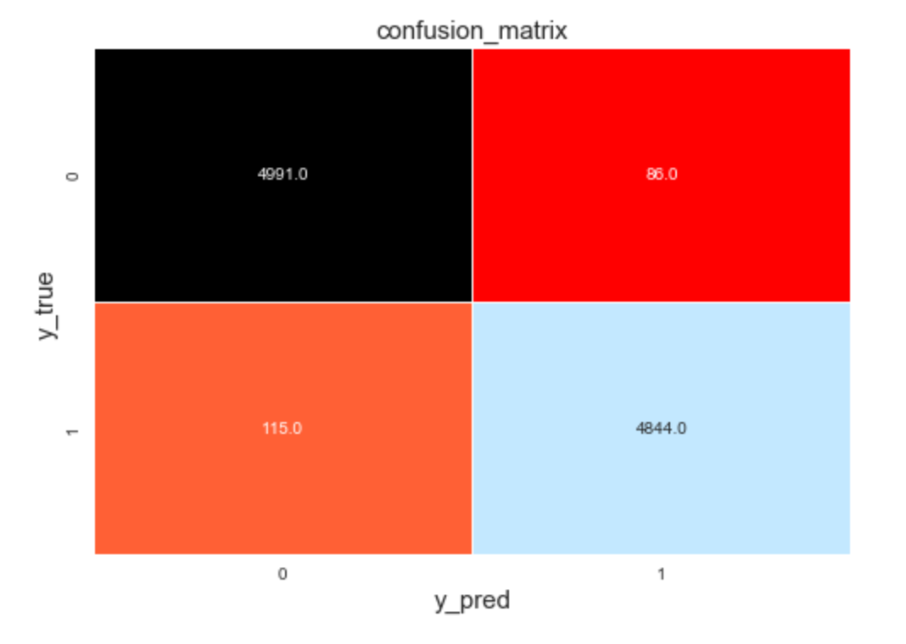
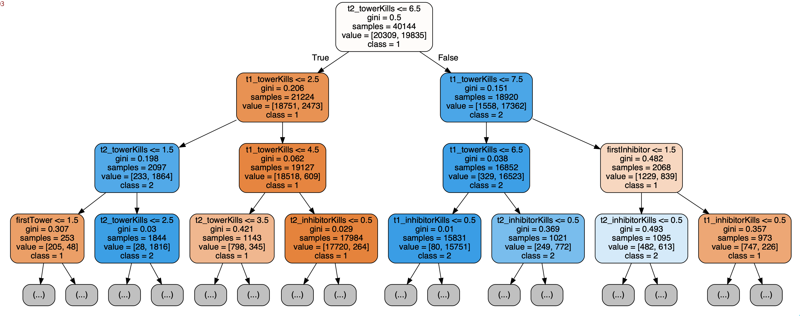
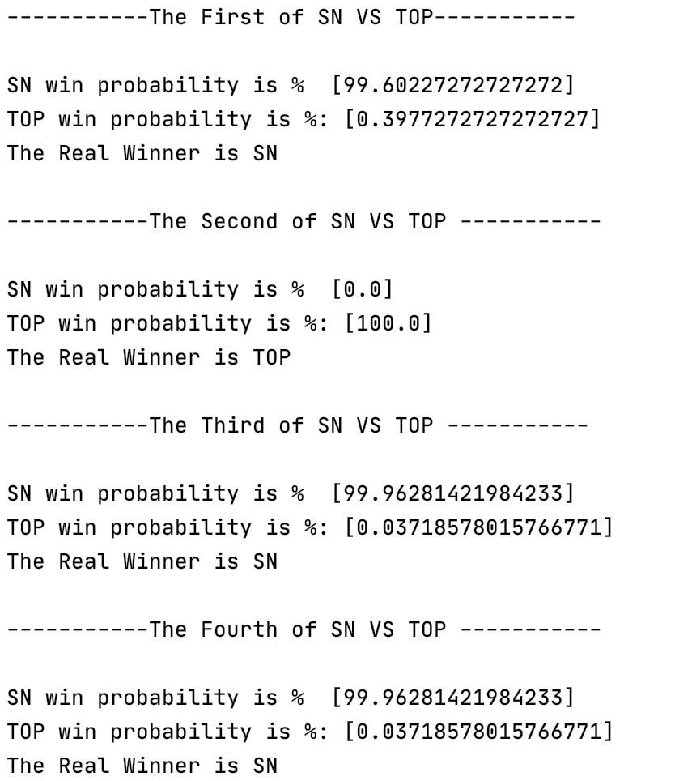

# 英雄联盟比赛得分预测

## 项目概述

英雄联盟（LoL）是美国游戏开发商Riot Games（2011年由腾讯收购）开发和发行的一款多人在线战斗竞技游戏。

在游戏中，玩家扮演一个"召唤师"角色，每个召唤师控制一个拥有独特技能的"英雄"，并与一组其他玩家或电脑控制的英雄战斗。游戏的目标是摧毁对方的防御塔和基地。

召唤者峡谷是英雄联盟中最受欢迎的地图，在这种地图类型中，两队五名玩家竞争摧毁一个被称为基地的敌人建筑，这个建筑由敌人的队伍和一些防御塔护卫。每个队伍都希望保卫自己的建筑，同时摧毁对方的建筑。这些主要包括:

1. Towers（防御塔）：每支队伍总共有11座防御塔
2. Inhibitor（水晶）：每条道有一个水晶
3. Elemental Drakes/Elder Dragon（小龙/远古龙）
4. Rift Herald（峡谷先锋）
5. Baron Nasho（纳什男爵）
6. Nexus（基地）

英雄联盟最具争议的元素之一，就是其严重的滚雪球效应。许多职业选手接受赛后采访时都提到其输赢都因为“滚雪球”，我们研究各方面各指标的数据，来看这些因素的发展是否真的影响了比赛的成败。在这个项目中，我们分析了5万多场英雄联盟的排名比赛，并尝试使用决策树算法来根据已有输入属性预测比赛胜负。

## 数据集概述

这是一个收集了超过50000个从游戏英雄联盟排位游戏，字段主要包含以下数据：

- Game ID：游戏ID
- Creation Time：创建时间
- Game Duration (in seconds)：游戏持续时间（秒）
- Season ID：赛季ID
- Winner (1=team1, 2=team2)：获胜队伍
- First Baron, dragon, tower, blood, inhibitor and Rift Herald (1 = team1, 2 = team2, 0 = none)：第一条纳什大龙，小龙，塔，一血，水晶，峡谷先锋
- Champions and summoner spells for each team (Stored as Riot's champion and summoner spell IDs)：每只队伍选择的英雄和召唤术
- The number of tower, inhibitor, Baron, dragon and Rift Herald kills each team has：塔，水晶，大龙，小龙和峡谷先锋击杀数
- The 5 bans of each team (Again, champion IDs are used)：每个队伍的禁用英雄

## 数据读入和预处理


```python
# 数据整理
import numpy as np 
import pandas as pd 

# 可视化
import matplotlib.pyplot as plt 
import seaborn as sns 
import plotly as py 
import plotly.graph_objs as go 

# 建模
from sklearn.tree import DecisionTreeClassifier
from sklearn.model_selection import train_test_split, GridSearchCV
from sklearn.metrics import confusion_matrix, classification_report 
```


```python
# 设置
pd.set_option('display.max_columns', None)  
pd.set_option('display.max_rows', 100)   

plt.style.use('seaborn') 
```


```python
# 读入数据
df = pd.read_csv('./archive/games.csv')
df.head() 
```


<div>
<style scoped>
    .dataframe tbody tr th:only-of-type {
        vertical-align: middle;
    }

    .dataframe tbody tr th {
        vertical-align: top;
    }
    
    .dataframe thead th {
        text-align: right;
    }
</style>
<table border="1" class="dataframe">
  <thead>
    <tr style="text-align: right;">
      <th></th>
      <th>gameId</th>
      <th>creationTime</th>
      <th>gameDuration</th>
      <th>seasonId</th>
      <th>winner</th>
      <th>firstBlood</th>
      <th>firstTower</th>
      <th>firstInhibitor</th>
      <th>firstBaron</th>
      <th>firstDragon</th>
      <th>firstRiftHerald</th>
      <th>t1_champ1id</th>
      <th>t1_champ1_sum1</th>
      <th>t1_champ1_sum2</th>
      <th>t1_champ2id</th>
      <th>t1_champ2_sum1</th>
      <th>t1_champ2_sum2</th>
      <th>t1_champ3id</th>
      <th>t1_champ3_sum1</th>
      <th>t1_champ3_sum2</th>
      <th>t1_champ4id</th>
      <th>t1_champ4_sum1</th>
      <th>t1_champ4_sum2</th>
      <th>t1_champ5id</th>
      <th>t1_champ5_sum1</th>
      <th>t1_champ5_sum2</th>
      <th>t1_towerKills</th>
      <th>t1_inhibitorKills</th>
      <th>t1_baronKills</th>
      <th>t1_dragonKills</th>
      <th>t1_riftHeraldKills</th>
      <th>t1_ban1</th>
      <th>t1_ban2</th>
      <th>t1_ban3</th>
      <th>t1_ban4</th>
      <th>t1_ban5</th>
      <th>t2_champ1id</th>
      <th>t2_champ1_sum1</th>
      <th>t2_champ1_sum2</th>
      <th>t2_champ2id</th>
      <th>t2_champ2_sum1</th>
      <th>t2_champ2_sum2</th>
      <th>t2_champ3id</th>
      <th>t2_champ3_sum1</th>
      <th>t2_champ3_sum2</th>
      <th>t2_champ4id</th>
      <th>t2_champ4_sum1</th>
      <th>t2_champ4_sum2</th>
      <th>t2_champ5id</th>
      <th>t2_champ5_sum1</th>
      <th>t2_champ5_sum2</th>
      <th>t2_towerKills</th>
      <th>t2_inhibitorKills</th>
      <th>t2_baronKills</th>
      <th>t2_dragonKills</th>
      <th>t2_riftHeraldKills</th>
      <th>t2_ban1</th>
      <th>t2_ban2</th>
      <th>t2_ban3</th>
      <th>t2_ban4</th>
      <th>t2_ban5</th>
    </tr>
  </thead>
  <tbody>
    <tr>
      <th>0</th>
      <td>3326086514</td>
      <td>1504279457970</td>
      <td>1949</td>
      <td>9</td>
      <td>1</td>
      <td>2</td>
      <td>1</td>
      <td>1</td>
      <td>1</td>
      <td>1</td>
      <td>2</td>
      <td>8</td>
      <td>12</td>
      <td>4</td>
      <td>432</td>
      <td>3</td>
      <td>4</td>
      <td>96</td>
      <td>4</td>
      <td>7</td>
      <td>11</td>
      <td>11</td>
      <td>6</td>
      <td>112</td>
      <td>4</td>
      <td>14</td>
      <td>11</td>
      <td>1</td>
      <td>2</td>
      <td>3</td>
      <td>0</td>
      <td>92</td>
      <td>40</td>
      <td>69</td>
      <td>119</td>
      <td>141</td>
      <td>104</td>
      <td>11</td>
      <td>4</td>
      <td>498</td>
      <td>4</td>
      <td>7</td>
      <td>122</td>
      <td>6</td>
      <td>4</td>
      <td>238</td>
      <td>14</td>
      <td>4</td>
      <td>412</td>
      <td>4</td>
      <td>3</td>
      <td>5</td>
      <td>0</td>
      <td>0</td>
      <td>1</td>
      <td>1</td>
      <td>114</td>
      <td>67</td>
      <td>43</td>
      <td>16</td>
      <td>51</td>
    </tr>
    <tr>
      <th>1</th>
      <td>3229566029</td>
      <td>1497848803862</td>
      <td>1851</td>
      <td>9</td>
      <td>1</td>
      <td>1</td>
      <td>1</td>
      <td>1</td>
      <td>0</td>
      <td>1</td>
      <td>1</td>
      <td>119</td>
      <td>7</td>
      <td>4</td>
      <td>39</td>
      <td>12</td>
      <td>4</td>
      <td>76</td>
      <td>4</td>
      <td>3</td>
      <td>10</td>
      <td>4</td>
      <td>14</td>
      <td>35</td>
      <td>4</td>
      <td>11</td>
      <td>10</td>
      <td>4</td>
      <td>0</td>
      <td>2</td>
      <td>1</td>
      <td>51</td>
      <td>122</td>
      <td>17</td>
      <td>498</td>
      <td>19</td>
      <td>54</td>
      <td>4</td>
      <td>12</td>
      <td>25</td>
      <td>4</td>
      <td>14</td>
      <td>120</td>
      <td>11</td>
      <td>4</td>
      <td>157</td>
      <td>4</td>
      <td>14</td>
      <td>92</td>
      <td>4</td>
      <td>7</td>
      <td>2</td>
      <td>0</td>
      <td>0</td>
      <td>0</td>
      <td>0</td>
      <td>11</td>
      <td>67</td>
      <td>238</td>
      <td>51</td>
      <td>420</td>
    </tr>
    <tr>
      <th>2</th>
      <td>3327363504</td>
      <td>1504360103310</td>
      <td>1493</td>
      <td>9</td>
      <td>1</td>
      <td>2</td>
      <td>1</td>
      <td>1</td>
      <td>1</td>
      <td>2</td>
      <td>0</td>
      <td>18</td>
      <td>4</td>
      <td>7</td>
      <td>141</td>
      <td>11</td>
      <td>4</td>
      <td>267</td>
      <td>3</td>
      <td>4</td>
      <td>68</td>
      <td>4</td>
      <td>12</td>
      <td>38</td>
      <td>12</td>
      <td>4</td>
      <td>8</td>
      <td>1</td>
      <td>1</td>
      <td>1</td>
      <td>0</td>
      <td>117</td>
      <td>40</td>
      <td>29</td>
      <td>16</td>
      <td>53</td>
      <td>69</td>
      <td>4</td>
      <td>7</td>
      <td>412</td>
      <td>14</td>
      <td>4</td>
      <td>126</td>
      <td>4</td>
      <td>12</td>
      <td>24</td>
      <td>4</td>
      <td>11</td>
      <td>22</td>
      <td>7</td>
      <td>4</td>
      <td>2</td>
      <td>0</td>
      <td>0</td>
      <td>1</td>
      <td>0</td>
      <td>157</td>
      <td>238</td>
      <td>121</td>
      <td>57</td>
      <td>28</td>
    </tr>
    <tr>
      <th>3</th>
      <td>3326856598</td>
      <td>1504348503996</td>
      <td>1758</td>
      <td>9</td>
      <td>1</td>
      <td>1</td>
      <td>1</td>
      <td>1</td>
      <td>1</td>
      <td>1</td>
      <td>0</td>
      <td>57</td>
      <td>4</td>
      <td>12</td>
      <td>63</td>
      <td>4</td>
      <td>14</td>
      <td>29</td>
      <td>4</td>
      <td>7</td>
      <td>61</td>
      <td>4</td>
      <td>1</td>
      <td>36</td>
      <td>11</td>
      <td>4</td>
      <td>9</td>
      <td>2</td>
      <td>1</td>
      <td>2</td>
      <td>0</td>
      <td>238</td>
      <td>67</td>
      <td>516</td>
      <td>114</td>
      <td>31</td>
      <td>90</td>
      <td>14</td>
      <td>4</td>
      <td>19</td>
      <td>11</td>
      <td>4</td>
      <td>412</td>
      <td>4</td>
      <td>3</td>
      <td>92</td>
      <td>4</td>
      <td>14</td>
      <td>22</td>
      <td>4</td>
      <td>7</td>
      <td>0</td>
      <td>0</td>
      <td>0</td>
      <td>0</td>
      <td>0</td>
      <td>164</td>
      <td>18</td>
      <td>141</td>
      <td>40</td>
      <td>51</td>
    </tr>
    <tr>
      <th>4</th>
      <td>3330080762</td>
      <td>1504554410899</td>
      <td>2094</td>
      <td>9</td>
      <td>1</td>
      <td>2</td>
      <td>1</td>
      <td>1</td>
      <td>1</td>
      <td>1</td>
      <td>0</td>
      <td>19</td>
      <td>4</td>
      <td>12</td>
      <td>29</td>
      <td>11</td>
      <td>4</td>
      <td>40</td>
      <td>4</td>
      <td>3</td>
      <td>119</td>
      <td>4</td>
      <td>7</td>
      <td>134</td>
      <td>7</td>
      <td>4</td>
      <td>9</td>
      <td>2</td>
      <td>1</td>
      <td>3</td>
      <td>0</td>
      <td>90</td>
      <td>64</td>
      <td>412</td>
      <td>25</td>
      <td>31</td>
      <td>37</td>
      <td>3</td>
      <td>4</td>
      <td>59</td>
      <td>4</td>
      <td>12</td>
      <td>141</td>
      <td>11</td>
      <td>4</td>
      <td>38</td>
      <td>4</td>
      <td>12</td>
      <td>51</td>
      <td>4</td>
      <td>7</td>
      <td>3</td>
      <td>0</td>
      <td>0</td>
      <td>1</td>
      <td>0</td>
      <td>86</td>
      <td>11</td>
      <td>201</td>
      <td>122</td>
      <td>18</td>
    </tr>
  </tbody>
</table>
</div>


```python
df.shape
```


    (51490, 61)


## 数据可视化

### 目标变量分布


```python
df.winner.value_counts() 
```


    1    26077
    2    25413
    Name: winner, dtype: int64


```python
# 饼图
trace0 = go.Pie(labels=df['winner'].value_counts().index, 
                values=df['winner'].value_counts().values,
                hole=0.5,
                opacity=0.9,
                marker=dict(line=dict(color='white', width=1.3))
               ) 
layout = go.Layout(title='目标变量winner分布')

data = [trace0]
fig = go.Figure(data, layout)
py.offline.plot(fig, filename='./html/整体获胜情况分布.html')
```


    './html/整体获胜情况分布.html'


数据集一共有51490条记录，其中1队获胜的次数为26077次，占比50.6%，2队获胜的次数为25413次，占比49.4%。不存在样本不平衡的情况。

### 游戏时长分布


```python
df['game_duration'] = round(df['gameDuration'] / 60) 

# 选择数据
x1 = df[df['winner'] == 1]['game_duration']
x2 = df[df['winner'] == 2]['game_duration'] 

# 直方图
trace0 = go.Histogram(x=x1, bingroup=25, name='team1', opacity=0.9)
trace1 = go.Histogram(x=x2, bingroup=25, name='team2', opacity=0.9)  

layout = go.Layout(title='比赛游戏时长分布') 

data = [trace0, trace1] 
fig = go.Figure(data, layout)
py.offline.plot(fig, filename='./html/游戏时长分布.html')
```


    './html/游戏时长分布.html'


从直方图可以看出，游戏时长大致服从正态分布，其中最短的游戏时长为3分钟，3分钟是游戏重开的时间点，最长的游戏时长是79分钟。中间50%的时长在26~36分钟之间。

### 一血对获胜的影响


```python
def plot_bar_horizontal(input_col: str, target_col: str, title_name: str):
    cross_table = round(pd.crosstab(df[input_col], df[target_col], normalize='index')*100, 2)

    # 索引
    index_0 = cross_table.columns.tolist()[0] 
    index_1 = cross_table.columns.tolist()[1] 
    
    # 绘图轨迹
    trace0 = go.Bar(x=cross_table[index_0].values.tolist(),
                    y=cross_table.index.tolist(), 
                    name=index_0,
                    orientation='h',
                    marker=dict(color='rgb(154,203,228)')
                   ) 
    trace1 = go.Bar(x=cross_table[index_1].values.tolist(),  
                    y=cross_table.index.tolist(),
                    name=index_1,
                    orientation='h',
                    marker=dict(color='rgb(191,76,81)')
                   ) 

    data = [trace0, trace1] 
    # 布局
    layout = go.Layout(title=title_name, bargap=0.4, barmode='stack')
    
    # 画布
    fig = go.Figure(data=data, layout=layout)
    # 绘图
    py.offline.plot(fig, filename=f'./html/{title_name}.html') 
```


```python
def plot_bar_vertical(input_col: str, target_col: str, title_name: str):
    cross_table = round(pd.crosstab(df[input_col], df[target_col], normalize='index')*100, 2)

    # 索引
    index_0 = cross_table.columns.tolist()[0] 
    index_1 = cross_table.columns.tolist()[1] 
    
    # 绘图轨迹
    trace0 = go.Bar(x=cross_table.index.tolist(),
                    y=cross_table[index_0].values.tolist(),
                    name=index_0,
                    orientation='v',
                    marker=dict(color='rgb(191,76,81)')
                   ) 
    trace1 = go.Bar(x=cross_table.index.tolist(),  
                    y=cross_table[index_1].values.tolist(),
                    name=index_1,
                    orientation='v',
                    marker=dict(color='rgb(154,203,228)')
                   ) 

    data = [trace0, trace1] 
    # 布局
    layout = go.Layout(title=title_name, bargap=0.4, barmode='stack')
    
    # 画布
    fig = go.Figure(data=data, layout=layout)
    # 绘图
    py.offline.plot(fig, filename=f'./html/{title_name}.html') 
```


```python
pd.crosstab(df['firstBlood'], df['winner'])  
```


<div>
<style scoped>
    .dataframe tbody tr th:only-of-type {
        vertical-align: middle;
    }

    .dataframe tbody tr th {
        vertical-align: top;
    }
    
    .dataframe thead th {
        text-align: right;
    }
</style>
<table border="1" class="dataframe">
  <thead>
    <tr style="text-align: right;">
      <th>winner</th>
      <th>1</th>
      <th>2</th>
    </tr>
    <tr>
      <th>firstBlood</th>
      <th></th>
      <th></th>
    </tr>
  </thead>
  <tbody>
    <tr>
      <th>0</th>
      <td>298</td>
      <td>257</td>
    </tr>
    <tr>
      <th>1</th>
      <td>15532</td>
      <td>10581</td>
    </tr>
    <tr>
      <th>2</th>
      <td>10247</td>
      <td>14575</td>
    </tr>
  </tbody>
</table>
</div>


```python
plot_bar_horizontal(input_col='firstBlood', target_col='winner', title_name='一血对获胜的影响')  
```

结论：获得一血的队伍胜率相对较高，在第一队的比赛中，首先获得一血时的胜率为59.48%，相较未获得一血的比赛高18%。在第二队的比赛中，获得一血时的胜率为58.72%，相较未获得一血的比赛高18%。

### 一塔对获胜的影响


```python
pd.crosstab(df['firstTower'], df['winner']) 
```


<div>
<style scoped>
    .dataframe tbody tr th:only-of-type {
        vertical-align: middle;
    }

    .dataframe tbody tr th {
        vertical-align: top;
    }
    
    .dataframe thead th {
        text-align: right;
    }
</style>
<table border="1" class="dataframe">
  <thead>
    <tr style="text-align: right;">
      <th>winner</th>
      <th>1</th>
      <th>2</th>
    </tr>
    <tr>
      <th>firstTower</th>
      <th></th>
      <th></th>
    </tr>
  </thead>
  <tbody>
    <tr>
      <th>0</th>
      <td>628</td>
      <td>585</td>
    </tr>
    <tr>
      <th>1</th>
      <td>18320</td>
      <td>7541</td>
    </tr>
    <tr>
      <th>2</th>
      <td>7129</td>
      <td>17287</td>
    </tr>
  </tbody>
</table>
</div>


```python
plot_bar_horizontal(input_col='firstTower', target_col='winner', title_name='一塔对获胜的影响')  
```

结论：从数据来看，第一个防御塔看起来是比较有说服力的指标。在第一队的比赛中，首先摧毁一塔时队伍的胜率高达70.84%，相较未获得一塔的比赛高41.64%。在第二队的比赛中，有相近的数据表现。

### 摧毁第一个水晶对获胜的影响


```python
pd.crosstab(df['firstInhibitor'], df['winner'])  
```


<div>
<style scoped>
    .dataframe tbody tr th:only-of-type {
        vertical-align: middle;
    }

    .dataframe tbody tr th {
        vertical-align: top;
    }
    
    .dataframe thead th {
        text-align: right;
    }
</style>
<table border="1" class="dataframe">
  <thead>
    <tr style="text-align: right;">
      <th>winner</th>
      <th>1</th>
      <th>2</th>
    </tr>
    <tr>
      <th>firstInhibitor</th>
      <th></th>
      <th></th>
    </tr>
  </thead>
  <tbody>
    <tr>
      <th>0</th>
      <td>3210</td>
      <td>3066</td>
    </tr>
    <tr>
      <th>1</th>
      <td>20949</td>
      <td>2105</td>
    </tr>
    <tr>
      <th>2</th>
      <td>1918</td>
      <td>20242</td>
    </tr>
  </tbody>
</table>
</div>


```python
plot_bar_horizontal(input_col='firstInhibitor', target_col='winner', title_name='摧毁第一个水晶对获胜的影响')  
```

结论：在比赛中拿到第一座水晶塔的队伍91%的情况下可以获胜，这一点在某种程度上是可以预见的，因为首先摧毁水晶塔代表队伍已经积累的足够的优势，而且水晶塔力量很强大，并且更具有价值。

### 击杀第一条大龙对获胜影响


```python
pd.crosstab(df['firstBaron'], df['winner']) 
```


<div>
<style scoped>
    .dataframe tbody tr th:only-of-type {
        vertical-align: middle;
    }

    .dataframe tbody tr th {
        vertical-align: top;
    }
    
    .dataframe thead th {
        text-align: right;
    }
</style>
<table border="1" class="dataframe">
  <thead>
    <tr style="text-align: right;">
      <th>winner</th>
      <th>1</th>
      <th>2</th>
    </tr>
    <tr>
      <th>firstBaron</th>
      <th></th>
      <th></th>
    </tr>
  </thead>
  <tbody>
    <tr>
      <th>0</th>
      <td>10844</td>
      <td>9414</td>
    </tr>
    <tr>
      <th>1</th>
      <td>11978</td>
      <td>2780</td>
    </tr>
    <tr>
      <th>2</th>
      <td>3255</td>
      <td>13219</td>
    </tr>
  </tbody>
</table>
</div>


```python
plot_bar_horizontal(input_col='firstBaron', target_col='winner', title_name='击杀第一条大龙对获胜影响')  
```

结论：统计数据显示，在比赛中击杀第一条大龙有80%的胜率。

### 击杀第一条小龙对获胜的影响


```python
pd.crosstab(df['firstDragon'], df['winner']) 
```


<div>
<style scoped>
    .dataframe tbody tr th:only-of-type {
        vertical-align: middle;
    }

    .dataframe tbody tr th {
        vertical-align: top;
    }
    
    .dataframe thead th {
        text-align: right;
    }
</style>
<table border="1" class="dataframe">
  <thead>
    <tr style="text-align: right;">
      <th>winner</th>
      <th>1</th>
      <th>2</th>
    </tr>
    <tr>
      <th>firstDragon</th>
      <th></th>
      <th></th>
    </tr>
  </thead>
  <tbody>
    <tr>
      <th>0</th>
      <td>1072</td>
      <td>928</td>
    </tr>
    <tr>
      <th>1</th>
      <td>16937</td>
      <td>7753</td>
    </tr>
    <tr>
      <th>2</th>
      <td>8068</td>
      <td>16732</td>
    </tr>
  </tbody>
</table>
</div>


```python
plot_bar_horizontal(input_col='firstDragon', target_col='winner', title_name='击杀第一条大龙对获胜的影响') 
```

结论：在第一个队伍中，首先击杀第一条小龙的队伍胜率在68.6%，相较未取得优先的比赛胜率高36%。

### 击杀第一条峡谷先锋对获胜的影响


```python
pd.crosstab(df['firstRiftHerald'], df['winner']) 
```


<div>
<style scoped>
    .dataframe tbody tr th:only-of-type {
        vertical-align: middle;
    }

    .dataframe tbody tr th {
        vertical-align: top;
    }
    
    .dataframe thead th {
        text-align: right;
    }
</style>
<table border="1" class="dataframe">
  <thead>
    <tr style="text-align: right;">
      <th>winner</th>
      <th>1</th>
      <th>2</th>
    </tr>
    <tr>
      <th>firstRiftHerald</th>
      <th></th>
      <th></th>
    </tr>
  </thead>
  <tbody>
    <tr>
      <th>0</th>
      <td>13309</td>
      <td>12870</td>
    </tr>
    <tr>
      <th>1</th>
      <td>8993</td>
      <td>3955</td>
    </tr>
    <tr>
      <th>2</th>
      <td>3775</td>
      <td>8588</td>
    </tr>
  </tbody>
</table>
</div>


```python
plot_bar_horizontal(input_col='firstRiftHerald', target_col='winner', 
                    title_name='击杀第一条峡谷先锋对获胜的影响')
```

结论：在第一个队伍中，首先击杀第一条峡谷先锋的队伍胜率在69.45%，相较未取得优先的比赛胜率高38.92%。

### 摧毁防御塔数对获胜影响


```python
df.t1_towerKills.value_counts() 
```


    11    5945
    0     5938
    10    5784
    9     5297
    1     4428
    3     4041
    2     3941
    8     3918
    4     3361
    7     3269
    5     2960
    6     2608
    Name: t1_towerKills, dtype: int64


```python
plot_bar_vertical(input_col='t1_towerKills', target_col='winner', title_name='摧毁防御塔数对获胜影响')  
```

结论：选择第一个队伍的摧毁防御塔数作为影响因素，可以看出，摧毁的防御塔数量越多，获胜的概率越大。当数量大于8个时，胜率大于85%。11个防御塔全部摧毁时的胜率为99.16%，当然也有8.4‰的翻盘概率。

### 摧毁水晶数对获胜影响


```python
df.t1_inhibitorKills.value_counts() 
```


    0     25732
    1      9567
    2      8879
    3      5104
    4      1584
    5       423
    6       137
    7        43
    8        11
    9         6
    10        4
    Name: t1_inhibitorKills, dtype: int64


```python
plot_bar_vertical(input_col='t1_inhibitorKills', target_col='winner', title_name='摧毁水晶数对获胜影响')  
```

结论：摧毁水晶的数目越多，获胜的概率越大。没有摧毁水晶的获胜概率为12.55%，摧毁一个的获胜概率为81.11%，两个为92.38%。

### 击杀大龙数对获胜影响


```python
df.t1_baronKills.value_counts() 
```


    0    34901
    1    14179
    2     2251
    3      149
    4        9
    5        1
    Name: t1_baronKills, dtype: int64


```python
plot_bar_vertical(input_col='t1_baronKills', target_col='winner', title_name='击杀大龙数对获胜影响')  
```

结论：击杀大龙数越多，获胜的概率越大，击杀5条大龙的数据仅有一条，后续需要删除。

### 击杀大龙数对获胜影响


```python
plot_bar_vertical(input_col='t1_dragonKills', target_col='winner', title_name='击杀大龙数对获胜影响')
```

结论：击杀大龙数数越多，获胜的概率越大

## 数据建模


```python
# 删除时间少于15分钟和分类数较少的记录
df = df[(df['gameDuration'] >= 900) & (df['t1_baronKills'] != 5)]
print(df.shape) 
```

    (50180, 62)


```python
# 筛选建模变量
df_model = df[['winner', 'firstBlood', 'firstTower', 'firstInhibitor', 'firstBaron',
              'firstDragon', 'firstRiftHerald', 't1_towerKills', 't1_inhibitorKills','t1_baronKills',
              't1_dragonKills', 't2_towerKills', 't2_inhibitorKills', 't2_baronKills', 't2_dragonKills'
              ]] 
df_model.head() 
```


<div>
<style scoped>
    .dataframe tbody tr th:only-of-type {
        vertical-align: middle;
    }

    .dataframe tbody tr th {
        vertical-align: top;
    }
    
    .dataframe thead th {
        text-align: right;
    }
</style>
<table border="1" class="dataframe">
  <thead>
    <tr style="text-align: right;">
      <th></th>
      <th>winner</th>
      <th>firstBlood</th>
      <th>firstTower</th>
      <th>firstInhibitor</th>
      <th>firstBaron</th>
      <th>firstDragon</th>
      <th>firstRiftHerald</th>
      <th>t1_towerKills</th>
      <th>t1_inhibitorKills</th>
      <th>t1_baronKills</th>
      <th>t1_dragonKills</th>
      <th>t2_towerKills</th>
      <th>t2_inhibitorKills</th>
      <th>t2_baronKills</th>
      <th>t2_dragonKills</th>
    </tr>
  </thead>
  <tbody>
    <tr>
      <th>0</th>
      <td>1</td>
      <td>2</td>
      <td>1</td>
      <td>1</td>
      <td>1</td>
      <td>1</td>
      <td>2</td>
      <td>11</td>
      <td>1</td>
      <td>2</td>
      <td>3</td>
      <td>5</td>
      <td>0</td>
      <td>0</td>
      <td>1</td>
    </tr>
    <tr>
      <th>1</th>
      <td>1</td>
      <td>1</td>
      <td>1</td>
      <td>1</td>
      <td>0</td>
      <td>1</td>
      <td>1</td>
      <td>10</td>
      <td>4</td>
      <td>0</td>
      <td>2</td>
      <td>2</td>
      <td>0</td>
      <td>0</td>
      <td>0</td>
    </tr>
    <tr>
      <th>2</th>
      <td>1</td>
      <td>2</td>
      <td>1</td>
      <td>1</td>
      <td>1</td>
      <td>2</td>
      <td>0</td>
      <td>8</td>
      <td>1</td>
      <td>1</td>
      <td>1</td>
      <td>2</td>
      <td>0</td>
      <td>0</td>
      <td>1</td>
    </tr>
    <tr>
      <th>3</th>
      <td>1</td>
      <td>1</td>
      <td>1</td>
      <td>1</td>
      <td>1</td>
      <td>1</td>
      <td>0</td>
      <td>9</td>
      <td>2</td>
      <td>1</td>
      <td>2</td>
      <td>0</td>
      <td>0</td>
      <td>0</td>
      <td>0</td>
    </tr>
    <tr>
      <th>4</th>
      <td>1</td>
      <td>2</td>
      <td>1</td>
      <td>1</td>
      <td>1</td>
      <td>1</td>
      <td>0</td>
      <td>9</td>
      <td>2</td>
      <td>1</td>
      <td>3</td>
      <td>3</td>
      <td>0</td>
      <td>0</td>
      <td>1</td>
    </tr>
  </tbody>
</table>
</div>


```python
# 查看缺失值
import missingno as msno

msno.bar(df_model)
plt.show()  
```


```python
# 划分训练集和测试集
x = df_model.drop('winner', axis=1)
y = df_model['winner']

X_train, X_test, y_train, y_test = train_test_split(x, y, test_size=0.2, stratify=y, random_state=0)
print(X_train.shape, X_test.shape, y_train.shape, y_test.shape) 
```

    (40144, 14) (10036, 14) (40144,) (10036,)


```python
# 参数
parameters = {
    'splitter': ('best', 'random'),
    'criterion':('gini', 'entropy'),
    'max_depth':[*range(1, 20, 2)],
}

# 建立模型
clf = DecisionTreeClassifier(random_state=0)
GS = GridSearchCV(clf, parameters, cv=10)
GS.fit(X_train, y_train)  
```


    GridSearchCV(cv=10, estimator=DecisionTreeClassifier(random_state=0),
                 param_grid={'criterion': ('gini', 'entropy'),
                             'max_depth': [1, 3, 5, 7, 9, 11, 13, 15, 17, 19],
                             'splitter': ('best', 'random')})


```python
# 输出最佳得分 
print("best score: ", GS.best_score_)
print("best param: ", GS.best_params_)
```

    best score:  0.9770077890521407
    best param:  {'criterion': 'gini', 'max_depth': 7, 'splitter': 'best'}


```python
# 最佳模型
best_clf = DecisionTreeClassifier(criterion="gini", max_depth=7, splitter="best")
best_clf.fit(X_train,y_train) 
print("score:", best_clf.score(X_test,y_test))   
```

    score: 0.9799721004384216


```python
# 分类报告
y_pred = best_clf.predict(X_test) 
cm = confusion_matrix(y_test, y_pred)
cr = classification_report(y_test, y_pred)
print('Classification report : \n', cr) 
```

    Classification report : 
                   precision    recall  f1-score   support
    
               1       0.98      0.98      0.98      5077
               2       0.98      0.98      0.98      4959
    
        accuracy                           0.98     10036
       macro avg       0.98      0.98      0.98     10036
    weighted avg       0.98      0.98      0.98     10036


```python
# 热力图
g1 = sns.heatmap(cm, annot=True, fmt=".1f", cmap="flag", linewidths=0.2, cbar=False)
g1.set_ylabel('y_true', fontdict={'fontsize': 15})
g1.set_xlabel('y_pred', fontdict={'fontsize': 15})  
g1.set_title('confusion_matrix', fontdict={'fontsize': 15})  
```


    Text(0.5, 1, 'confusion_matrix')




```python
# 输出属性重要性
imp = pd.DataFrame(list(zip(X_train.columns, best_clf.feature_importances_))) 
imp.columns = ['columns', 'importances']
imp = imp.sort_values('importances', ascending=False)
imp
```


<div>
<style scoped>
    .dataframe tbody tr th:only-of-type {
        vertical-align: middle;
    }

    .dataframe tbody tr th {
        vertical-align: top;
    }
    
    .dataframe thead th {
        text-align: right;
    }
</style>
<table border="1" class="dataframe">
  <thead>
    <tr style="text-align: right;">
      <th></th>
      <th>columns</th>
      <th>importances</th>
    </tr>
  </thead>
  <tbody>
    <tr>
      <th>10</th>
      <td>t2_towerKills</td>
      <td>0.720592</td>
    </tr>
    <tr>
      <th>6</th>
      <td>t1_towerKills</td>
      <td>0.231177</td>
    </tr>
    <tr>
      <th>7</th>
      <td>t1_inhibitorKills</td>
      <td>0.016769</td>
    </tr>
    <tr>
      <th>11</th>
      <td>t2_inhibitorKills</td>
      <td>0.014381</td>
    </tr>
    <tr>
      <th>2</th>
      <td>firstInhibitor</td>
      <td>0.010415</td>
    </tr>
    <tr>
      <th>1</th>
      <td>firstTower</td>
      <td>0.001764</td>
    </tr>
    <tr>
      <th>8</th>
      <td>t1_baronKills</td>
      <td>0.001608</td>
    </tr>
    <tr>
      <th>13</th>
      <td>t2_dragonKills</td>
      <td>0.000973</td>
    </tr>
    <tr>
      <th>9</th>
      <td>t1_dragonKills</td>
      <td>0.000742</td>
    </tr>
    <tr>
      <th>12</th>
      <td>t2_baronKills</td>
      <td>0.000640</td>
    </tr>
    <tr>
      <th>3</th>
      <td>firstBaron</td>
      <td>0.000271</td>
    </tr>
    <tr>
      <th>4</th>
      <td>firstDragon</td>
      <td>0.000264</td>
    </tr>
    <tr>
      <th>0</th>
      <td>firstBlood</td>
      <td>0.000202</td>
    </tr>
    <tr>
      <th>5</th>
      <td>firstRiftHerald</td>
      <td>0.000201</td>
    </tr>
  </tbody>
</table>
</div>


在属性的重要性排序中，击杀防御塔数量的重要性最高，其次是水晶摧毁数量、一塔、击杀龙的数量。


```python
# 可视化
import graphviz
from sklearn import tree 

dot_data = tree.export_graphviz(decision_tree=best_clf, max_depth=3,
                                 out_file=None, 
                                 feature_names=X_train.columns,
                                 class_names=['1', '2'], 
                                 filled=True,
                                 rounded=True
                                )
graph = graphviz.Source(dot_data)
graph
```





## 模型预测

我们假设:

第一队拿了第一血，第一塔，第一大龙，第一条大龙和第一峡谷先锋，而第二队只拿了第一个水晶。

第一队的塔，水晶，大龙和龙杀死的数量分别是10,2,1,4和塔，水晶，大龙和龙的数量分别是7,2,1,1。


```python
# 新数据
new_data = [[1, 1, 2, 1, 1, 1, 10, 2, 1, 4, 7, 2, 1, 1]]
c = best_clf.predict_proba(new_data).reshape(-1, 1) 
print("winner is :" , best_clf.predict(x1)) 
print("First team win probability is % ", list(c[0] * 100),
      "\nSecond team win probability is %:",list(c[1] * 100)) 
```

    winner is : [1]
    First team win probability is %  [89.87341772151899] 
    Second team win probability is %: [10.126582278481013]


根据模型预测结果，第一队将会获胜，获胜的概率为89.87%。

## SN VS TOP(2020.10.25)

```
#第一盘:
#   一血      一塔     水晶    第一条大龙  第一条小龙  第一个峡谷先锋
#  1(SN)    2(TOP)   1(SN)    1(SN)      2(TOP)     2(TOP)
# SN推塔数量 推水晶数量 大龙数量 小龙数量
#     7         1       1       2
# TOP推塔数量 推水晶数量 大龙数量 小龙数量
#     3         0       1       3
new_data1 = [[1, 2, 1, 1, 2, 2, 7, 1, 1, 2, 3, 0, 1, 3]]
c = best_clf.predict_proba(new_data1).reshape(-1, 1)
print("-----------The First of SN VS TOP----------- \n")
print("SN win probability is % ", list(c[0] * 100),
      "\nTOP win probability is %:", list(c[1] * 100),"\nThe Real Winner is SN\n")
#第二盘:
#   一血      一塔     水晶    第一条大龙  第一条小龙  第一个峡谷先锋
#  1(SN)    2(TOP)   2(TOP)    2(TOP)    1(SN)     2(TOP)
# SN推塔数量 推水晶数量 大龙数量 小龙数量
#      3         0       0       3
# TOP推塔数量 推水晶数量 大龙数量 小龙数量
#     10         2       1       2
new_data2 = [[1, 2, 2, 2, 1, 2, 3, 0, 0, 3, 10, 2, 1, 2]]
c = best_clf.predict_proba(new_data2).reshape(-1, 1)
print("-----------The Second of SN VS TOP ----------- \n")
print("SN win probability is % ", list(c[0] * 100),
      "\nTOP win probability is %:", list(c[1] * 100),"\nThe Real Winner is TOP\n")
#第三盘:
#   一血      一塔     水晶    第一条大龙  第一条小龙  第一个峡谷先锋
#  1(SN)    1(SN)   1(SN)    1(SN)    2(TOP)        1(SN)
# SN推塔数量 推水晶数量 大龙数量 小龙数量
#     11        3       1       4
# TOP推塔数量 推水晶数量 大龙数量 小龙数量
#     3         0       0       2
new_data3 = [[1, 1, 1, 1, 2, 1, 11, 3, 1, 4, 3, 0, 0, 2]]
c = best_clf.predict_proba(new_data3).reshape(-1, 1)
print("-----------The Third of SN VS TOP ----------- \n")
print("SN win probability is % ", list(c[0] * 100),
      "\nTOP win probability is %:", list(c[1] * 100),"\nThe Real Winner is SN\n")
#第四盘:
#   一血      一塔     水晶    第一条大龙  第一条小龙  第一个峡谷先锋
#  1(SN)    1(SN)   1(SN)    1(SN)      2(TOP)        1(SN)
# SN推塔数量 推水晶数量 大龙数量 小龙数量
#     11        1       2       3
# TOP推塔数量 推水晶数量 大龙数量 小龙数量
#     1         0       0       3
new_data4 = [[1, 1, 1, 1, 2, 1, 11, 3, 1, 4, 3, 0, 0, 2]]
c = best_clf.predict_proba(new_data4).reshape(-1, 1)
print("-----------The Fourth of SN VS TOP ----------- \n")
print("SN win probability is % ", list(c[0] * 100),
      "\nTOP win probability is %:", list(c[1] * 100),"\nThe Real Winner is SN")
```



